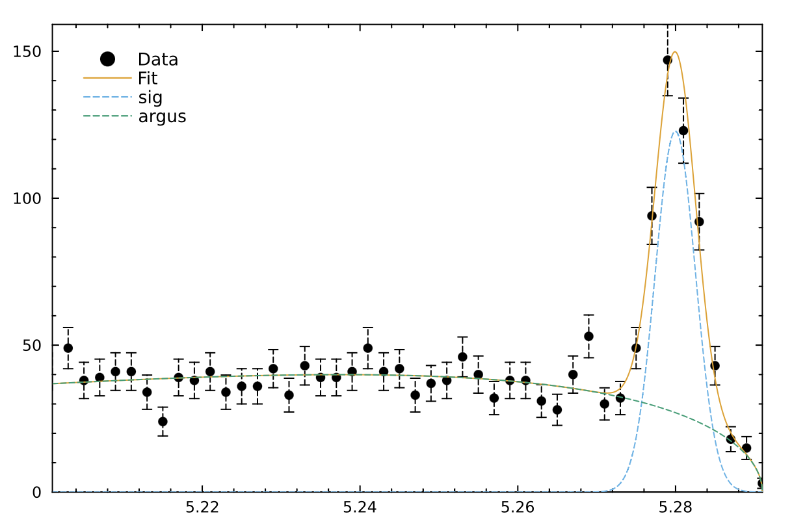

# Julia bindings for Minuit2

## Description

Julia bindings for the [**Minuit2**](https://root.cern/root/htmldoc/guides/minuit2/Minuit2.html) minimization package. It provides a Julia-friendly interface to the C++ library, maintained by CERN's [ROOT team](https://root.cern.ch). Minuit2 is designed for function minimization, particularly in statistical applications such as maximum-likelihood estimation and least-squares fitting. It computes best-fit parameters and error estimates using likelihood profile analysis

The API and additional features of this package are heavily inspired by [iminuit](https://scikit-hep.org/iminuit/), which offers a Python-friendly interface to the same library.

We have provided an additional module `Minuit2.RooFit` with an initial implementation in Julia of the [RooFit](https://root.cern/manual/roofit/) modeling package often used in HEP data analysis. This package can help to build complex PDF models using basic elements and combining them.

## Installation
The Minuit2.jl package does no require any special installation. Stable releases are registered into the Julia general registry, and therefore can be deployed with the standard `Pkg` Julia package manager.
```julia
julia> using Pkg
julia> Pkg.add("Minuit2")
```
## API Guidelines
A mutable `Minuit` structure instance is constructed from the cost function to be minimised and its gradient, if available, otherwise Minuit2 uses an internal numerical differentiation, and a number of initial parameters. This structure is later used in the application to perform different minimization algorithms with different strategies and the evaluation of the results. The user provides always a Julia cost function to be evaluated by the C++ engine as a callback.

## Getting Started

```julia
julia> using Minuit2

julia> rosenbrock(x, y) = (1 - x)^2 + 100 * (y - x^2)^2
rosenbrock (generic function with 1 method)

julia> m = Minuit(rosenbrock, x=0, y=0, tolerance=1e-4)
Minuit(FCN = rosenbrock(x, y), X0 = [0, 0], Method = migrad)

julia> migrad!(m)
┌──────────────┬──────────────┬───────────┬────────────┬────────────┐
│ FCN          │ Method       │ Ncalls    │ Iterations │ Up         │
│ 1.68596e-8   │ migrad       │ 146       │ 19         │ 1.0        │
├──────────────┼──────────────┼───────────┼────────────┼────────────┤
│ Valid Min.   │ Valid Param. │ Above EDM │ Call limit │ Edm        │
│ true         │ true         │ false     │ false      │ 1.68793e-8 │
├──────────────┼──────────────┼───────────┼────────────┼────────────┤
│ Hesse failed │ Has cov.     │ Accurate  │ Pos. def.  │ Forced     │
│ false        │ true         │ true      │ true       │ false      │
└──────────────┴──────────────┴───────────┴────────────┴────────────┘
┌──────┬──────────┬─────────────┬────────┬────────┬────────┬────────┬───────┐
│ Name │ Value    │ Hesse Error │ Minos- │ Minos+ │ Limit- │ Limit+ │ Fixed │
├──────┼──────────┼─────────────┼────────┼────────┼────────┼────────┼───────┤
│ x    │ 0.999952 │ 1.00372     │        │        │        │        │       │
│ y    │ 0.999892 │ 2.00986     │        │        │        │        │       │
└──────┴──────────┴─────────────┴────────┴────────┴────────┴────────┴───────┘


julia> minos!(m)
┌──────────────┬──────────────┬───────────┬────────────┬────────────┐
│ FCN          │ Method       │ Ncalls    │ Iterations │ Up         │
│ 1.68596e-8   │ migrad       │ 146       │ 19         │ 1.0        │
├──────────────┼──────────────┼───────────┼────────────┼────────────┤
│ Valid Min.   │ Valid Param. │ Above EDM │ Call limit │ Edm        │
│ true         │ true         │ false     │ false      │ 1.68793e-8 │
├──────────────┼──────────────┼───────────┼────────────┼────────────┤
│ Hesse failed │ Has cov.     │ Accurate  │ Pos. def.  │ Forced     │
│ false        │ true         │ true      │ true       │ false      │
└──────────────┴──────────────┴───────────┴────────────┴────────────┘
┌──────┬──────────┬─────────────┬───────────┬─────────┬────────┬────────┬───────┐
│ Name │ Value    │ Hesse Error │ Minos-    │ Minos+  │ Limit- │ Limit+ │ Fixed │
├──────┼──────────┼─────────────┼───────────┼─────────┼────────┼────────┼───────┤
│ x    │ 0.999952 │ 1.00372     │ -0.999952 │ 1.00005 │        │        │       │
│ y    │ 0.999892 │ 2.00986     │ -1.03349  │ 3.00136 │        │        │       │
└──────┴──────────┴─────────────┴───────────┴─────────┴────────┴────────┴───────┘


julia> x, y = m.values
[0.9999518621622189, 0.9998916674647496]

julia> ex, ey = m.errors
[1.0037197729944198, 2.009856810740231]
```

### Minuit2.RooFit module

This is simple example of the functionality of the `Minuit2.RooFit` module provided additionally to this package.
```julia
#---Observable
mes =  RealVar(:mes, limits=(5.20, 5.30), nbins=50)

#---Gaussian signal
sigmean = RealVar(:sigmean, 5.28, limits=(5.20, 5.30))
sigwidth = RealVar(:sigwidth, 0.0027, limits=(0.001, 0.1))
sig = Gaussian(:sig, mes, sigmean, sigwidth)

#---Build Argus background
argpar = RealVar(:argpar, -20.0, limits=(-100., -1.))
argus = ArgusPdf(:argus, mes, ConstVar(:m₀, 5.291), argpar)

#---Build the model
nsig = RealVar(:nsig, 200., limits=(0., 10000.))
nbkg = RealVar(:nbkg, 800., limits=(0., 10000.))
model = AddPdf(:model, [sig, argus], [nsig, nbkg])

#--- Generate a toyMC sample from composite PDF ---
data = generate(model, 2000)

#--- Perform extended unbinned NLL fit ---
m = fitTo(model, data)

#--- Visualize the results
visualize(m, model, components=(:sig, :argus); nbins=50, linestyle=:dash, legend=:topleft)
```



## Examples
Some notebooks are provided as examples. They are located in directory `examples`. They can be run using Julia to launch the notebook or jupyterlab. 

```
julia --project=Minuit2.jl/examples

julia> ]instantiate
julia> installkernel("Julia", env=Dict("JULIA_PROJECT" => "@."))
julia> jupyterlab(dir="Minuit2.jl/examples")
```

### introduction.ipynb
Basic introduction to minimization with Minuit using simple Julia functions and exercising the plotting capabilities. 

### costfunction.ipynb
Introduction of the provided cost functions for a typical HEP minimization problem. 

### combined.ipynb
A quick guide on how to combined several fits into a single one using the Minuit2 package.

### roofit.ipynb
A quick guide on how to use the RooFit module to perform fits.


## Tests
Unit tests can be run with `julia --project=. test/runtests.jl`

## Roadmap
There are a number of issues and problems still to be resolved. We keep track of them in this list:
- Weighted histograms need to be implemented
- More tutorials:
    - Automatic differentiation
    - Benchmarks (fit quality and performance)
- More in RooFit module
    - Complete the available PDFs (e.g. RooBCPEffDecay, RooBMixDecay, RooBifurGauss, RooBreitWigner,
      RooCBShape, RooPolynomial, etc.)
    - More compositions (e.g. multiplication, composition and convolution)

